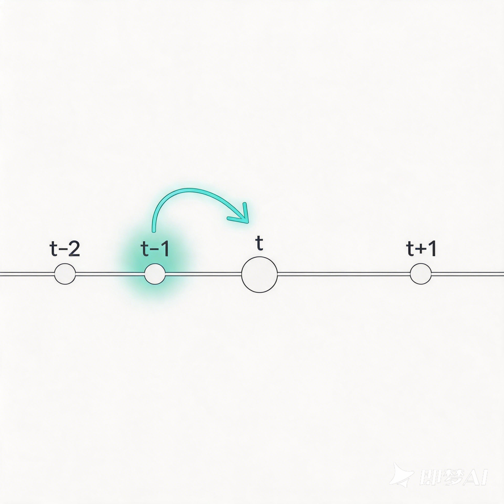
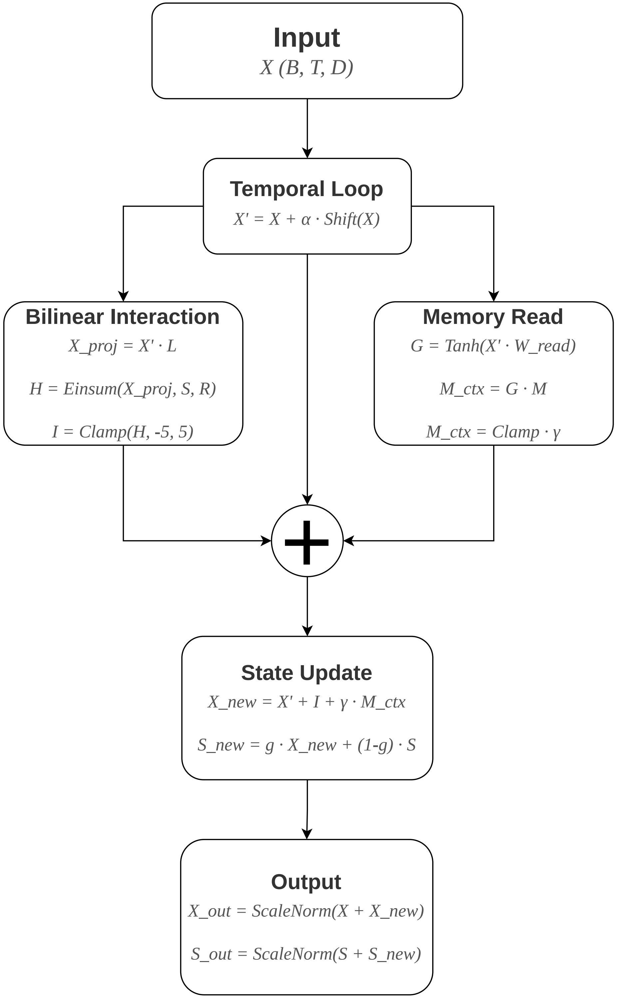
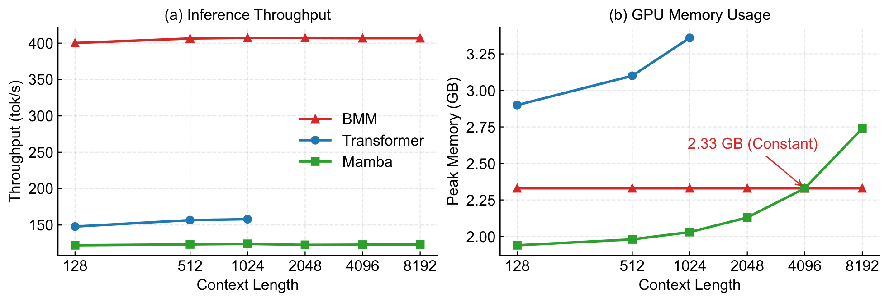
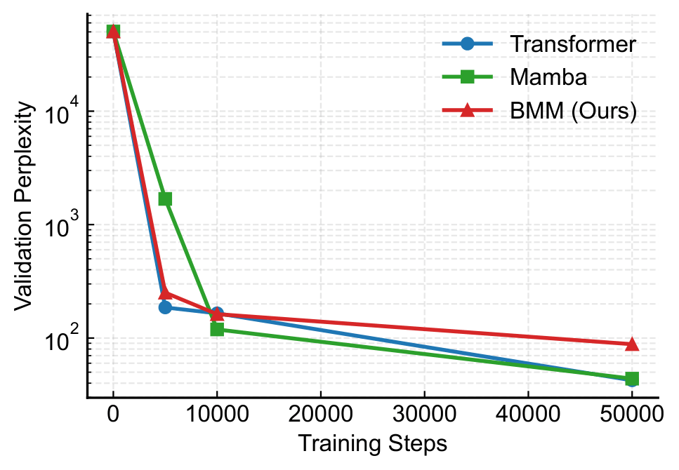
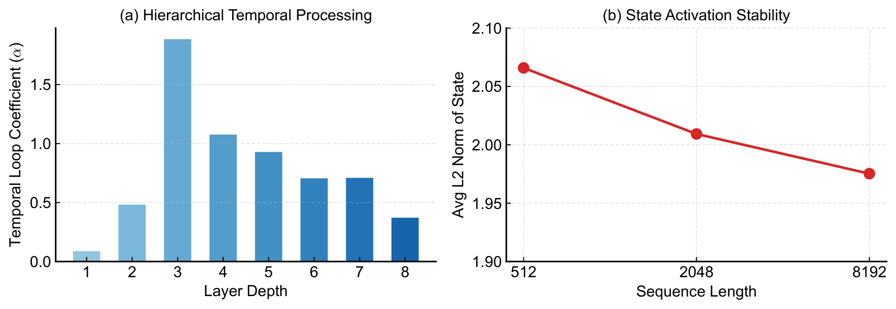

# BMM: Bilinear Memory Machine

[](LICENSE)
[](https://www.python.org/)
[](https://pytorch.org/)

[English](./README.md) | [简体中文](./README_CN.md)

---

BMM is a pure attention-free architecture for efficient long-context sequence modeling. It eliminates dot-product attention, softmax, and convolution entirely, relying instead on bilinear state interactions, dynamic memory slots, and temporal loops. BMM achieves strict $O(1)$ inference memory and 3x higher throughput than Mamba.

## 🌟 Key Features

- **Pure Attention-Free**: No QKV dot-product, no softmax, no gated recurrence. Relies purely on bilinear operations and gating.
- **Strict $O(1)$ Inference Memory**: Maintains a constant memory footprint (~1.5GB) during autoregressive generation, regardless of context length.
- **Extreme Throughput**: Achieves ~400 tokens/s, yielding 3x higher throughput than Mamba and remaining OOM-free at 100K context lengths.
- **Parallel Training**: Highly optimized matrix operations allow for 2x faster training compared to equivalent Transformers.

## 🏗️ Architecture

BMM processes sequences through stacked Bilinear Memory Blocks. Each block integrates three novel components to capture sequence dependencies without recurrent scans or quadratic attention:

1. **Bilinear Interaction**: Fuses input and hidden state via a low-rank bilinear product, capturing second-order interactions in $O(TDrS)$ time.
2. **Memory Slots**: Acts as an explicit external knowledge base with gated read operations, decoupling long-term storage from short-term dynamic processing.
3. **Temporal Loop**: A lightweight one-tap causal shift that mixes adjacent time steps, providing sequence order inductive bias while maintaining full parallelism.

<p align="center">
  
  
  
</p>
<p align="center"><em>Conceptual visualization of BMM core components.</em></p>

<p align="center">
  
</p>
<p align="center"><em>Detailed architecture of the Bilinear Memory Block.</em></p>

## 📊 Performance

BMM demonstrates decisive advantages in computational efficiency and long-context stability.

### Inference Efficiency & Memory
BMM maintains strictly constant memory and high throughput, while Transformer OOMs and Mamba's memory grows with context length.

<p align="center">
  
</p>

### Training Dynamics & Mechanism Diagnostics
<p align="center">
  
</p>
<p align="center"><em>Validation perplexity trajectories during 50,000 training steps.</em></p>

<p align="center">
  
</p>
<p align="center"><em>Mechanism diagnostics. Left: Memory slot semantic clustering. Right: Temporal loop alpha distribution across layers.</em></p>

## 🛠️ Installation

To install the necessary dependencies:

```bash
pip install -r requirements.txt
```

*Note: This implementation requires a single NVIDIA RTX 4090 (24GB) GPU for full reproduction. The `mamba_ssm` package requires a CUDA toolkit for compilation.*

## 🚀 Quick Start

### Train BMM from scratch

```bash
python train_bmm.py --gamma 2.0 --steps 50000
```

### Evaluate Inference Efficiency

```bash
python evaluate.py --model bmm --checkpoint path/to/bmm.pt
```

### Run 100K Streaming Test

```bash
python eval_streaming.py --context_len 102400
```

## 📁 Repository Structure

- `bmm_model.py`: Core BMM architecture and BPE data loader.
- `train_bmm.py`, `train_transformer.py`, `train_mamba.py`: Training scripts for main experiments.
- `evaluate.py`: Script to reproduce main PPL and efficiency results.
- `eval_streaming.py`: Script for 100K extreme streaming generation test.
- `run_ablations.py`: Script for architecture ablation studies.
- `assets/`: Architecture diagrams and performance charts.

## 📦 Pre-trained Checkpoints

Due to file size limits, pre-trained checkpoints (~200M params) can be downloaded from:
[[Download Link Here - e.g., Google Drive or HuggingFace](https://huggingface.co/Shutong-Hou/Bilinear-Memory-Machine-V1)]

## 📄 License

This project is licensed under the Apache License 2.0 - see the [LICENSE](LICENSE) file for details.
