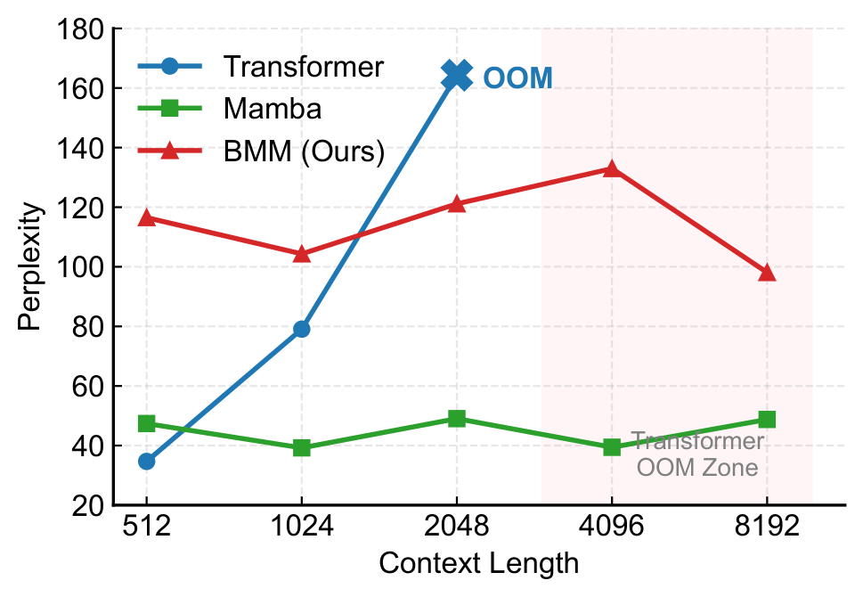

# BMM: 双线性记忆机

[](LICENSE)
[](https://www.python.org/)
[](https://pytorch.org/)

[English](./README.md) | [简体中文](./README_CN.md)

---

BMM 是一种用于高效长上下文序列建模的纯无注意力架构。它消除了点积注意力、softmax 和卷积，完全依赖于双线性状态交互、动态记忆槽和时序循环。BMM 实现了严格的 $O(1)$ 推理显存占用，且吞吐量是 Mamba 的 3 倍。

## 🌟 核心特性

- **纯无注意力**: 无 QKV 点积、无 softmax、无门控递归。完全依赖双线性运算和门控机制。
- **严格 $O(1)$ 推理显存**: 无论上下文长度如何增加，推理时始终保持恒定的显存占用 (~1.5GB)。
- **极致吞吐量**: 达到 ~400 tokens/s 的生成速度，比 Mamba 快 3 倍，并在 100K 上下文长度下不发生 OOM。
- **全并行训练**: 高度优化的矩阵运算使得训练速度达到同等规模 Transformer 的 2 倍。

## 🏗️ 架构详解

BMM 通过堆叠多个 Bilinear Memory Block 来处理序列。每个 Block 集成了三个核心组件，以无需递归扫描或二次复杂度注意力的方式捕获序列依赖：

1. **双线性交互**: 通过低秩双线性乘积将输入和隐藏状态进行融合，以 $O(TDrS)$ 的线性复杂度捕获二阶交互信息。
2. **记忆槽**: 作为外部的静态知识库，通过门控读取机制，解耦长短期记忆。
3. **时序循环**: 通过一个可学习的标量混合相邻时间步，以极低的成本提供序列顺序的归纳偏置。

<p align="center">
  
  
  
</p>
<p align="center"><em>BMM 核心组件概念图。</em></p>

<p align="center">
  
</p>
<p align="center"><em>Bilinear Memory Block 详细架构图。</em></p>

## 📊 性能展示

BMM 在计算效率和长上下文稳定性方面展现出决定性优势。

### 推理效率与显存
BMM 保持恒定的显存和高吞吐量，而 Transformer 会发生 OOM，Mamba 的显存随上下文长度增加而增长。

<p align="center">
  
</p>

### 长上下文外推
随着序列长度增加，BMM 保持稳定的困惑度，而 Transformer 在超过 2K tokens 后崩溃。

<p align="center">
  
</p>
### 训练动态与机制诊断
<p align="center">
  
</p>
<p align="center"><em>50,000 步训练期间的验证困惑度轨迹。</em></p>

<p align="center">
  
</p>
<p align="center"><em>机制诊断。左：记忆槽语义聚类。右：各层时序循环 Alpha 分布。</em></p>

## 🛠️ 环境配置

安装必要的依赖项：

```bash
pip install -r requirements.txt
```

*注意：本实现基于单张 NVIDIA RTX 4090 (24GB) GPU。`mamba_ssm` 包需要 CUDA 工具链进行编译。*

## 🚀 快速开始

### 从头训练 BMM
```bash
python train_bmm.py --gamma 2.0 --steps 50000
```

### 评估推理效率
```bash
python evaluate.py --model bmm --checkpoint path/to/bmm.pt
```

### 运行 100K 流式生成测试
```bash
python eval_streaming.py --context_len 102400
```

## 📁 仓库结构

- `bmm_model.py`: BMM 核心架构与 BPE 数据加载器。
- `train_bmm.py`, `train_transformer.py`, `train_mamba.py`: 主实验训练脚本。
- `evaluate.py`: 复现主 PPL 和效率结果的脚本。
- `eval_streaming.py`: 100K 极限流式生成测试脚本。
- `run_ablations.py`: 架构消融实验脚本。
- `assets/`: 架构图与性能图表。

## 📦 预训练权重

由于文件大小限制，预训练权重 (~200M params) 可从以下链接下载：
[下载链接 - 例如 Google Drive 或 HuggingFace]

## 📄 许可证

本项目基于 Apache License 2.0 授权 - 详见 [LICENSE](LICENSE) 文件。